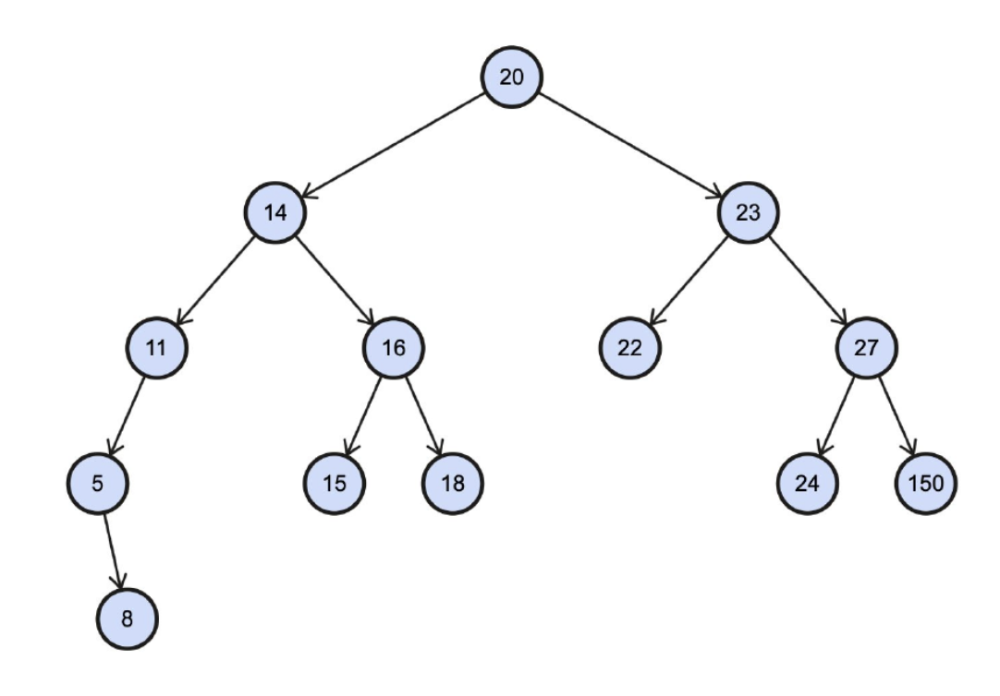

# День 10

## Темы
- Двоичное дерево поиска.

## Задачи
### 1 
Вам необходимо создать двоичное дерево поиска, изображенное на картинке выше.
Для этого создайте класс **“Узел”** (англ. *Node*), который будет содержать поля-ссылки
на два других узла (левый и правый сын).
Затем, создайте корневой (англ. **root**) узел (со значением 20).
После этого, необходимо реализовать метод, который будет добавлять новые узлы в
ваше дерево.
Этот метод должен принимать в качестве аргументов добавляемое значение и ссылку
на корень дерева. Проходясь по дереву, он должен вставлять новый узел в
правильное место дерева.
Когда двоичное дерево, изображенное выше, будет создано, необходимо используя
рекурсию вывести в консоль все числа из этого двоичного дерева поиска в
отсортированном виде. Ваше решение должно работать для любого корректного
двоичного дерева поиска.
Этому методу необходимо передавать на вход ссылку на корень дерева.

**[Решение задачи 1](Solution.java)**

#### Немножко теория
Двоичное дерево поиска строится по определенным правилам:
- каждый узел имеет не более двух детей;
- каждое значение, меньшее, чем значение узла, становится левым ребенком или ребенком левого ребенка;
- каждое значение, большее или равное значению узла, становится правым ребенком или ребенком правого ребенка. 

    

